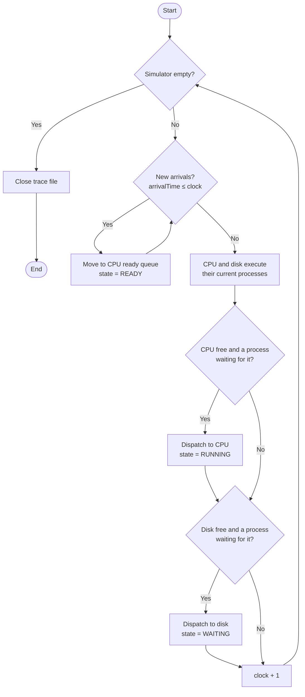
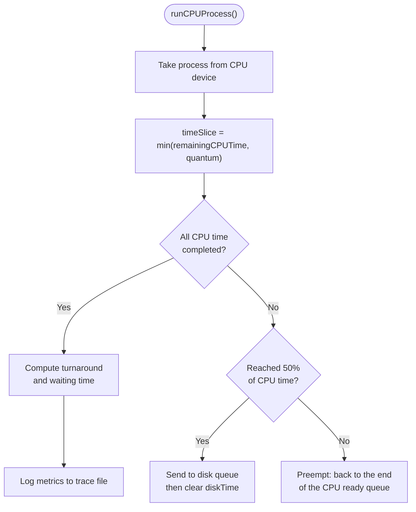

# Process Scheduling Simulator — Round Robin

A discrete-time simulator written in C that models how an operating system's short-term (CPU) scheduler shares a CPU and a disk between competing processes using the **Round Robin (RR)** algorithm.

The simulator generates random workloads, runs them tick by tick, records per-process metrics, and includes an evaluation pipeline that measures how the size of the time quantum affects average waiting time and turnaround time. Results can be plotted with the included Python scripts, and the whole codebase is documented with Doxygen.

---

## Quick Start (Windows)

The repository includes three ready-made scripts, so you don't need to type any commands. Run them in this order, either by double-clicking them in File Explorer or from a Command Prompt opened in the project folder:

| Step | Script                        | What it does                                                         |
|:----:|-------------------------------|----------------------------------------------------------------------|
| 1    | `CompileAndRun.bat`           | Compiles the C code, then runs the simulation and the evaluation     |
| 2    | `Run_Simulation_Analysis.bat` | Generates the plots and summary tables from the evaluation results   |
| 3    | `DoxygenGeneration.bat`       | Generates the HTML documentation (independent of steps 1 and 2)      |

The only thing you need to install yourself is **GCC** (see [Requirements](#requirements)). If Python or Doxygen is missing, the scripts offer to install it for you.

```bash
https://github.com/AliMorie/Round_Robin_Scheduler.git
cd Round_Robin_Scheduler
```

After step 3, open `Docs/html/index.html` in a browser to read the documentation.

On Linux or macOS, follow the [manual setup](#manual-setup-linux--macos) instead.

---

## Table of Contents

- [Quick Start (Windows)](#quick-start-windows)
- [Features](#features)
- [Project Structure](#project-structure)
- [Usage in Detail](#usage-in-detail)
  - [Requirements](#requirements)
  - [1. Compile and Run](#1-compile-and-run)
  - [2. Simulation Analysis and Plots](#2-simulation-analysis-and-plots)
  - [3. Generating the Documentation](#3-generating-the-documentation)
  - [Manual Setup (Linux / macOS)](#manual-setup-linux--macos)
- [How It Works](#how-it-works)
  - [Round Robin in Brief](#round-robin-in-brief)
  - [Simulation Model](#simulation-model)
  - [Main Simulation Loop](#main-simulation-loop)
  - [Running a Process on the CPU](#running-a-process-on-the-cpu)
  - [Data Structures](#data-structures)
  - [Program Flow](#program-flow)
  - [Evaluation](#evaluation)
- [Configuration](#configuration)
- [Sample Results](#sample-results)
- [Code and Documentation Conventions](#code-and-documentation-conventions)

---

## Features

- Round Robin CPU scheduling with a configurable time quantum.
- The CPU and the disk are modeled as separate devices, each with its own waiting queue.
- A random workload generator draws arrival, CPU and disk times from configurable parameters.
- Per-process metrics are recorded: turnaround time and waiting time.
- A built-in evaluation runs the scheduler across a range of quantum values and exports the results to CSV.
- Python scripts plot the results and print summary tables.
- Full Doxygen documentation, including the system calls each function makes and what they return.
- One-click Windows scripts for building, analysis and documentation.

---

## Project Structure

```
Round_Robin_Scheduler/
├── src/                          # C source code
│   ├── Main.c                    # Entry point: argument parsing, setup, simulation, evaluation
│   ├── DataStructures.h          # Process, queue and simulator structures
│   ├── DataGenerator.c/.h        # Random workload generation and input-file reading
│   ├── Scheduler.c/.h            # Round Robin simulation logic
│   ├── Evaluation.c/.h           # Experiments across a range of quantum values
│   └── Helper.c/.h               # Shared helper functions
├── input/                        # Generated workload (input_file.txt)
├── output/                       # Simulation results (output.csv)
├── Docs/
│   ├── Doxyfile                  # Doxygen configuration
│   └── mainpage.dox              # Main page of the generated documentation
├── CompileAndRun.bat             # Step 1: build and run
├── Run_Simulation_Analysis.bat   # Step 2: plots and tables
├── DoxygenGeneration.bat         # Step 3: documentation
├── Plot_Data_1.py                # Evaluation plots
├── Plot_Data_2.py                # Evaluation plots
├── Print_Tables.py               # Summary tables
└── requirements.txt              # Python dependencies
```

---

## Usage in Detail

### Requirements

| Tool     | Needed for                   | How to get it on Windows                                                                                          |
|----------|------------------------------|-------------------------------------------------------------------------------------------------------------------|
| GCC      | Building the simulator       | Install MinGW-w64 (for example through [MSYS2](https://www.msys2.org/)) and add its `bin` folder to your `PATH`. Check with `gcc --version`. |
| Python 3 | Plots and tables             | Installed automatically by `Run_Simulation_Analysis.bat` if missing, or from [python.org](https://www.python.org/downloads/) |
| Doxygen  | Generating the documentation | Installed automatically by `DoxygenGeneration.bat` if missing, or from [doxygen.nl](https://www.doxygen.nl/download.html) |

### 1. Compile and Run

Run **`CompileAndRun.bat`**. It:

1. Creates the `input` and `output` folders if they don't exist yet.
2. Compiles all source files in `src/` into an executable named `Simulator`, linking the math library (`-lm`).
3. Stops with a "Compilation failed" message if the build fails.
4. Runs the simulator with these default arguments:

   ```bat
   .\Simulator 10 ".\input\input_file.txt" 3 ".\output\output.csv"
   ```

The simulator takes four arguments:

| Argument       | Default                    | Description                                                          |
|----------------|----------------------------|----------------------------------------------------------------------|
| `numProcesses` | `10`                       | Number of processes to generate                                      |
| `inputFile`    | `.\input\input_file.txt`   | File where the generated process data is written and then read back  |
| `quantum`      | `3`                        | Time quantum (time slice) for the Round Robin scheduler              |
| `outputFile`   | `.\output\output.csv`      | Trace file where the metrics of each completed process are written   |

To try different values, edit that last line of `CompileAndRun.bat`.

A run produces:

- `input/input_file.txt`, the generated workload.
- `output/output.csv`, the per-process results of the simulation.
- The evaluation results in `log.csv`, together with the trace files used to produce them. The evaluation runs automatically after the simulation.

The output file is opened in append mode, so results from repeated runs accumulate. Delete it between runs if you want a fresh file.

### 2. Simulation Analysis and Plots

Run **`Run_Simulation_Analysis.bat`** after step 1, since it needs the evaluation results. It:

1. Checks that Python is installed. If it isn't, it asks for confirmation, then downloads and installs Python 3.10 from python.org.
2. Looks for a virtual environment named `myenv` in the project folder:
   - **If it exists,** activates it and continues.
   - **If it doesn't exist,** creates it, activates it and installs the dependencies from `requirements.txt`. If the installation fails, the incomplete environment is deleted so the next run starts cleanly.
3. Runs `Plot_Data_1.py`, `Plot_Data_2.py` and `Print_Tables.py`.
4. Deactivates the virtual environment and waits for a key press before closing.

The first run takes longer because it creates the environment and downloads the packages. Later runs reuse the environment and start right away. If you change `requirements.txt`, delete the `myenv` folder so the next run reinstalls the dependencies.

What the scripts produce:

- **Plot scripts:** charts of average waiting time and average turnaround (completion) time against the quantum, for example `SchedulingResultAnalysis_1.png`.
- **`Print_Tables.py`:** tables of the average completion time and average waiting time for each quantum value, printed to the terminal.

### 3. Generating the Documentation

Run **`DoxygenGeneration.bat`**. It:

1. Looks for Doxygen on your `PATH`, then in its default install location (`C:\Program Files\doxygen\bin`).
2. If Doxygen isn't found, asks for confirmation and installs it using `winget`, or Chocolatey if `winget` isn't available. If neither works, it points you to the manual download.
3. Runs Doxygen with the configuration in `Docs/Doxyfile`.
4. Copies the source code into `Docs/src`.

If Doxygen was just installed but can't be found afterwards, close the terminal, open a new one and run the script again, so the updated `PATH` takes effect.

**Viewing the documentation:** open `Docs/html/index.html` in a browser. The top navigation bar has three sections:

- **Main Page:** an overview of the simulator and how it runs, generated from `Docs/mainpage.dox`.
- **Classes:** every struct, with each of its members documented.
- **Files:** every source file, with its functions, parameters and return values.

Every function that makes a system call (such as `malloc`, `fopen`, `fprintf`, `fclose` or `free`) has a **System Calls** section listing each call and what it returns.

**Using the Doxygen GUI (optional):** open Doxywizard, choose **File → Open**, and select `Docs/Doxyfile`. Adjust any settings in the **Wizard** or **Expert** tabs, then go to the **Run** tab and click **Run doxygen**.

### Manual Setup (Linux / macOS)

The `.bat` scripts only run on Windows. On Linux or macOS, the same steps can be run by hand from the project folder.

**Install the requirements:**

| Tool     | Linux                                   | macOS                    |
|----------|-----------------------------------------|--------------------------|
| GCC      | `sudo apt install build-essential`      | `xcode-select --install` |
| Python 3 | `sudo apt install python3 python3-venv` | `brew install python`    |
| Doxygen  | `sudo apt install doxygen`              | `brew install doxygen`   |

**1. Compile and run:**

```bash
mkdir -p input output
gcc -o Simulator src/*.c -lm
./Simulator 10 input/input_file.txt 3 output/output.csv
```

**2. Analysis and plots:**

```bash
# Create the virtual environment only if it doesn't exist yet
if [ ! -d myenv ]; then
    python3 -m venv myenv
    source myenv/bin/activate
    pip install -r requirements.txt
else
    source myenv/bin/activate
fi

python3 Plot_Data_1.py
python3 Plot_Data_2.py
python3 Print_Tables.py

deactivate
```

**3. Documentation:**

```bash
doxygen Docs/Doxyfile
```

Then open `Docs/html/index.html` in a browser.

---

## How It Works

### Round Robin in Brief

In Round Robin scheduling, every ready process gets the CPU for at most one **time quantum** (time slice). If a process has not finished when its quantum expires, it is preempted and moved to the back of the ready queue, and the next process gets its turn. This guarantees that no single process can hold the CPU indefinitely and that every process gets a fair share of CPU time.

The quantum size is the key tuning parameter. A very small quantum causes constant interruptions and long overall completion times, while a very large one makes Round Robin behave like first-come, first-served. This simulator exists to measure that trade-off.

### Simulation Model

The simulator (`ProcessSimulator`) keeps a global clock and moves processes between five queues:

| Queue           | Role                                                          |
|-----------------|---------------------------------------------------------------|
| `ArrivalQueue`  | Processes that have not arrived yet, in order of arrival time |
| `CPUScheduler`  | The ready queue: processes waiting for the CPU                |
| `CPUDevice`     | The process currently executing on the CPU                    |
| `DiskScheduler` | Processes waiting for the disk                                |
| `DiskDevice`    | The process currently using the disk                          |

Each process is always in one of the states defined by `Process_State_T`, such as `READY`, `RUNNING` and `WAITING`.

### Main Simulation Loop

`simulateProcesses()` runs until every queue is empty. On each clock tick it:

1. Moves every process whose arrival time has been reached from the arrival queue to the CPU ready queue, and marks it `READY`.
2. Lets the CPU and the disk execute the processes currently assigned to them.
3. If the CPU is free and a process is waiting in the ready queue, dispatches it to the CPU and marks it `RUNNING`.
4. If the disk is free and a process is waiting for it, dispatches it to the disk and marks it `WAITING`.
5. Advances the clock by one.

When all queues are empty, the trace file is closed and the output is complete.



### Running a Process on the CPU

`runCPUProcess()` handles one turn on the CPU:

1. The process is taken from the CPU device.
2. Its time slice is the smaller of its remaining CPU time and the quantum, so a process that needs less than a full quantum only uses what it needs.
3. If the process has now completed all of its CPU time, its turnaround time and waiting time are calculated and written to the trace file.
4. Otherwise, the scheduler checks whether the process has reached the halfway point of its CPU time. At that point it performs its disk operation: it is sent to the disk queue, and its disk time is then cleared so the operation happens only once.
5. If neither applies, the process is preempted and placed back at the end of the CPU ready queue.



### Data Structures

All structures are defined in `DataStructures.h`.

**`Process_Struct`** represents a single process:

| Field              | Description                                  |
|--------------------|----------------------------------------------|
| `processID`        | Unique ID of the process                     |
| `arrivalTime`      | Clock time at which the process arrives      |
| `CPUTime`          | Total CPU time the process requires          |
| `diskTime`         | Disk time the process requires               |
| `remainingCPUTime` | CPU time still left to execute               |
| `turnAroundTime`   | Time from arrival to completion              |
| `waitingTime`      | Time spent waiting rather than executing     |
| `fileID`           | ID of the trace file the process came from   |
| `state`            | Current state (`Process_State_T`)            |

**`Queue`** holds an array of processes together with `front`, `rear` and `size` values. `initQueue()` allocates the array for a given number of processes.

**`ProcessSimulator`** holds the five queues described above, the clock and the time quantum. It is set up by `createSimulator()`.

### Program Flow

`Main.c` performs these steps:

1. Checks that the correct number of command-line arguments was given, and prints the correct usage if not.
2. Converts the arguments to the appropriate types.
3. Seeds the random number generator so every run produces a different workload.
4. Generates data for the requested number of processes and writes it to the input file.
5. Reads the input file back into an array of processes.
6. Creates the simulator with the chosen quantum.
7. Runs the simulation and writes the results to the output trace file.
8. Runs the full evaluation (see below).
9. Frees all allocated memory.

Each line of the input file describes one process:

```
processID fileID arrivalTime CPUTime diskTime
```

### Evaluation

`EvaluateAlgo()` measures how the quantum affects performance:

1. Generates five trace files, `trace1.txt` to `trace5.txt`, each with a fixed number of processes.
2. Clears any previous `log.csv` so it only contains the latest results.
3. Writes the CSV header: `quantum, fileID, turnAroundTime, waitingTime`.
4. For every quantum between `minQuantum` and `maxQuantum`, runs a full simulation on every trace file and appends the results to `log.csv`.

The Python scripts then read `log.csv` to produce plots and tables.

---

## Configuration

The random workload is controlled by these constants:

| Constant           | Default | Meaning                                  |
|--------------------|---------|------------------------------------------|
| `ARRIVAL_RATE`     | `0.5`   | Rate at which new processes arrive       |
| `MEAN_CPU_TIME`    | `10.0`  | Average CPU time per process             |
| `STDDEV_CPU_TIME`  | `1.0`   | Variation of the CPU time                |
| `MEAN_DISK_TIME`   | `5.0`   | Average disk time per process            |
| `STDDEV_DISK_TIME` | `0.5`   | Variation of the disk time               |

The evaluation is controlled by `minQuantum` and `maxQuantum`, which set the range of quantum values tested, and by constants that set the number of trace files and the number of processes per file. Run `CompileAndRun.bat` again after changing any of these, so the simulator is rebuilt.

---

## Sample Results

Results from one evaluation run with quantum values from 1 to 10. Because every run generates a new random workload, your exact numbers will differ.

| Quantum | Avg. Completion Time | Avg. Waiting Time |
|:-------:|---------------------:|------------------:|
| 1       | 725.448              | 714.984           |
| 2       | 623.448              | 612.984           |
| 3       | 611.476              | 601.012           |
| 4       | 572.448              | 561.984           |
| 5       | **426.752**          | **416.288**       |
| 6       | 597.948              | 587.484           |
| 7       | 572.448              | 561.984           |
| 8       | 546.948              | 536.484           |
| 9       | 521.448              | 510.984           |
| 10      | **401.252**          | **390.788**       |

With an average CPU time of 10, quantum values of 5 and 10 performed best. A quantum equal to the processes' CPU time, or one that divides it evenly, lets processes finish in a whole number of turns with no leftover fragment that has to wait through another full round of the queue.

---

## Code and Documentation Conventions

**Naming**

- `camelCase` for functions, variables and parameters, for example `simulateProcesses` and `outputTraceFile`.
- `UPPER_SNAKE_CASE` for constants, for example `MEAN_CPU_TIME`.
- `Pascal_Snake_Case` for types, for example `Process_Struct` and `Process_State_T`.

**Documentation comments**

Functions are documented with Doxygen `///` comments, using Markdown for headings, lists and bold text:

```c
/// Initializes a queue structure.
///
/// Allocates memory for the processes array and sets the front, rear, and size values.
///
/// ## System Calls
/// 1. **malloc:** Returns a pointer to the allocated memory block, or NULL if the allocation fails.
///
/// @param queue        A pointer to the Queue structure to be initialized.
/// @param numProcesses The number of processes in the queue.
void initQueue(Queue* queue, int numProcesses);
```

Struct members are documented inline with `///<`:

```c
int arrivalTime;  ///< An integer representing the arrival time of the process.
```
